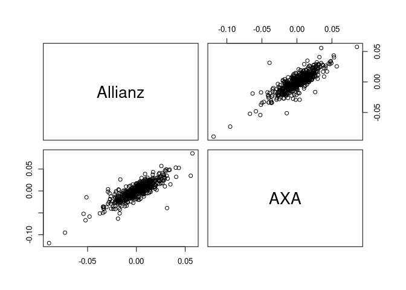

<!-- README.md is generated from README.Rmd. Please edit that file -->
<!-- badges: start -->

[](https://github.com/tnagler/svines/actions)
[](https://app.codecov.io/gh/tnagler/svines?branch=main)
[](https://CRAN.R-project.org/package=svines)
<!-- badges: end -->

An R package that provides functionality to fit and simulate from
[stationary vine copula models for time
series](https://arxiv.org/abs/2008.05990).

The package is build on top of
[rvinecopulib](https://github.com/vinecopulib/rvinecopulib) and
[univariateML](https://github.com/JonasMoss/univariateML).

## Installation

Install the development version from Github.

``` r
# install.packages("remotes")
remotes::install_github("tnagler/svines")
```

## Usage

For detailed documentation and examples, see the [API
documentation](https://tnagler.github.io/svines/).

``` r
library(svines)
#> Loading required package: rvinecopulib
data(returns)  # data set of stock returns
returns <- returns[1:500, 1:2]
```

### Fitting models

``` r
fit <- svine(returns, p = 1)  # Markov order 1
#> Warning in f(x, na.rm = na.rm): The iteration limit (iterlim = 100) was reached
#> before the relative tolerance requirement (rel.tol = 0.0001220703125).

#> Warning in f(x, na.rm = na.rm): The iteration limit (iterlim = 100) was reached
#> before the relative tolerance requirement (rel.tol = 0.0001220703125).
summary(fit)
#> $margins
#> # A data.frame: 2 x 5 
#>  margin    name          model                         parameters loglik
#>       1 Allianz Skew Student-t 0.00039, 0.01589, 5.45533, 0.91785   1382
#>       2     AXA Skew Student-t 0.00052, 0.02089, 4.35198, 0.90611   1260
#> 
#> $copula
#> # A data.frame: 5 x 10 
#>  tree edge conditioned conditioning var_types family rotation   parameters df
#>     1    1        2, 1                    c,c      t        0   0.86, 3.48  2
#>     1    2        3, 2                    c,c      t        0 0.037, 4.893  2
#>     2    1        4, 2            3       c,c    joe       90          1.1  1
#>     2    2        3, 1            2       c,c  indep        0               0
#>     3    1        4, 1         2, 3       c,c      t        0 0.079, 8.994  2
#>     tau
#>   0.662
#>   0.023
#>  -0.033
#>   0.000
#>   0.051
```

``` r
contour(fit$copula)
```


### Simulation

`svine_sim()` can be used in two different ways:

#### Generate a new time series of length 500

``` r
sim <- svine_sim(n = 500, rep = 1, model = fit)
pairs(sim)
```



``` r
pairs(returns)
```


#### Sample conditionally on the past given the past

``` r
sim <- svine_sim(n = 1, rep = 100, model = fit, past = returns)
pairs(t(sim[1, , ]))
```


### Standard errors

To generate new bootstrapped models from the asymptotic distribution,
use

``` r
models <- svine_bootstrap_models(2, fit)
summary(models[[1]])
#> $margins
#> # A data.frame: 2 x 5 
#>  margin    name          model                          parameters loglik
#>       1 Allianz Skew Student-t -0.00048, 0.01754, 3.87548, 0.86223     NA
#>       2     AXA Skew Student-t  3.3e-05, 2.2e-02, 3.5e+00, 8.5e-01     NA
#> 
#> $copula
#> # A data.frame: 5 x 10 
#>  tree edge conditioned conditioning var_types family rotation   parameters df
#>     1    1        2, 1                    c,c      t        0   0.89, 3.60  2
#>     1    2        3, 2                    c,c      t        0 0.037, 4.364  2
#>     2    1        4, 2            3       c,c    joe       90          1.1  1
#>     2    2        3, 1            2       c,c  indep        0               0
#>     3    1        4, 1         2, 3       c,c      t        0  0.04, 15.17  2
#>     tau
#>   0.694
#>   0.024
#>  -0.070
#>   0.000
#>   0.025
summary(models[[1]])
#> $margins
#> # A data.frame: 2 x 5 
#>  margin    name          model                          parameters loglik
#>       1 Allianz Skew Student-t -0.00048, 0.01754, 3.87548, 0.86223     NA
#>       2     AXA Skew Student-t  3.3e-05, 2.2e-02, 3.5e+00, 8.5e-01     NA
#> 
#> $copula
#> # A data.frame: 5 x 10 
#>  tree edge conditioned conditioning var_types family rotation   parameters df
#>     1    1        2, 1                    c,c      t        0   0.89, 3.60  2
#>     1    2        3, 2                    c,c      t        0 0.037, 4.364  2
#>     2    1        4, 2            3       c,c    joe       90          1.1  1
#>     2    2        3, 1            2       c,c  indep        0               0
#>     3    1        4, 1         2, 3       c,c      t        0  0.04, 15.17  2
#>     tau
#>   0.694
#>   0.024
#>  -0.070
#>   0.000
#>   0.025
```

## References

Nagler, T., Krüger, D., Min, A. (2022). Stationary vine copula models
for multivariate time series. *Journal of Econometrics, 227(2),
pp. 305-324* [\[pdf\]](https://arxiv.org/abs/2008.05990)
[\[doi\]](https://www.sciencedirect.com/science/article/pii/S0304407621003043)
